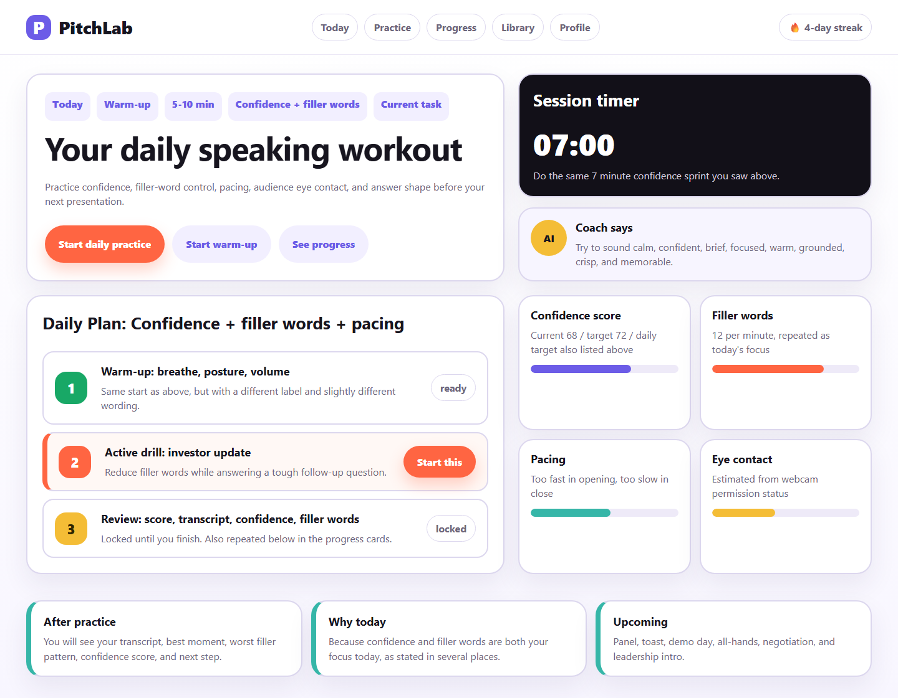
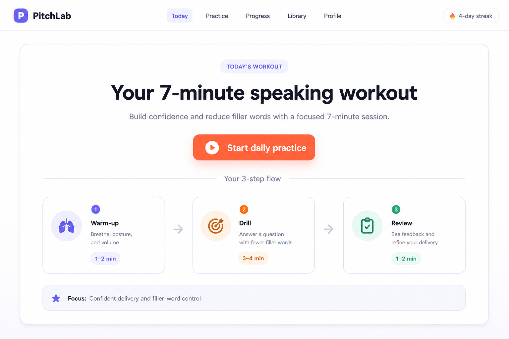
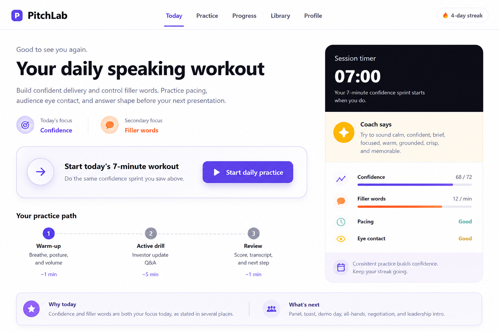
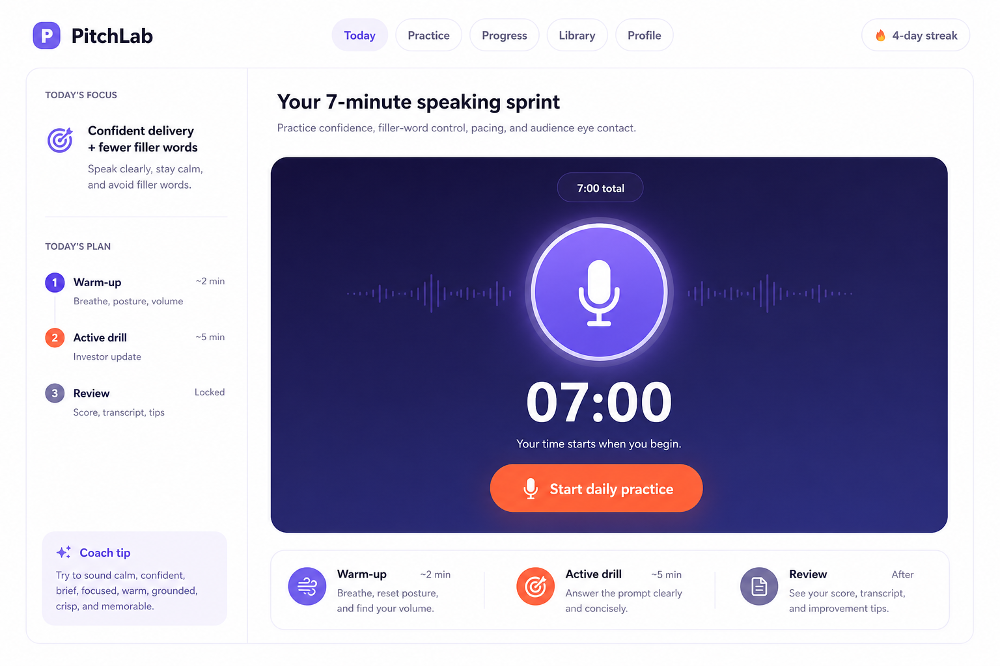
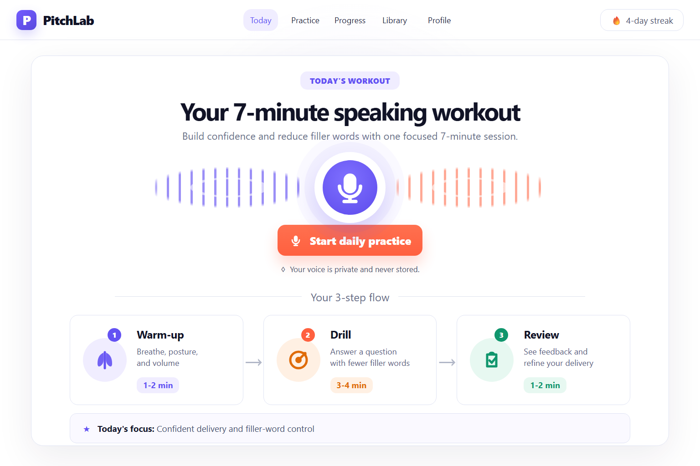
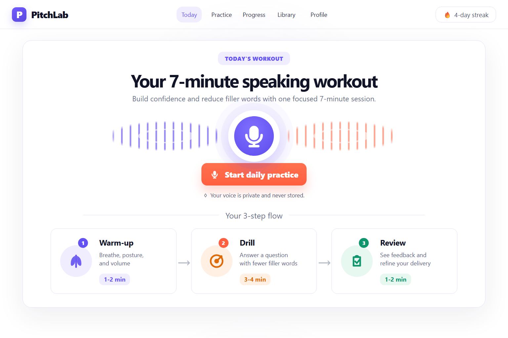
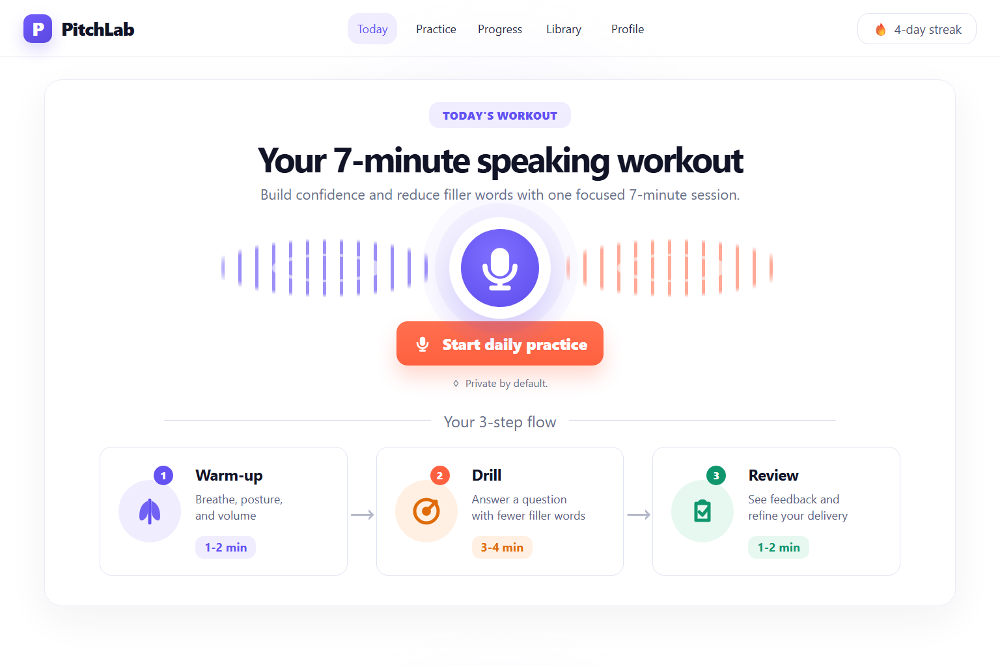
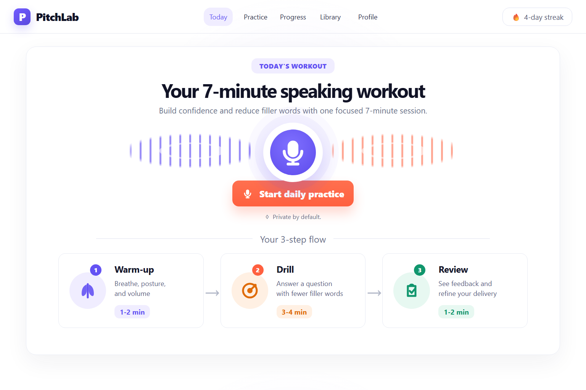

# PitchLab Coach Demo

This is a full Agent UI Flow hillclimb.

It starts with a deliberately bad running UI, uses seeded GPT image generation for visual search,
implements the selected direction as a real page, runs another image round from the implementation
screenshot, then finishes with four manual review/fix/compare rounds.

## 1. Bad Seed Screen

The first screen is a real browser screenshot, not an image prompt.

Problems: too many cards, repeated focus copy, competing CTAs, dashboard metrics before action, and
weak product identity.

## 2. Seeded Image Round 1

The first API batch produced contact sheets, which was useful but invalid as an implementation seed.
The flow caught that and reran the round as separate single-screen generations.

Selected Round 1 direction:

Useful rejected alternatives:

## 3. Seeded Image Round 2

Round 2 used the selected Round 1 image as the actual image seed.

Selected direction:

Why it won: it kept the clean flow, added a clear public-speaking identity, and stayed implementable.

## 4. Faithful Implementation

The selected image became a real static page. The first implementation had icon and badge problems;
those were fixed before continuing.

Fidelity verdict: pass, 14/16.

## 5. Image Round From Implementation

The running implementation screenshot became the next seed.

Selected improvement signal:

Main lesson: keep the current structure, remove leftover decoration, and make the frame quieter.

## 6. Four Manual Rounds

Round 1 removed the redundant focus strip.

Round 2 shortened privacy copy and softened the panel.

Round 3 tightened spacing and typography.

Round 4 polished CTA/card affordances.

## 7. Final

The final screen is still a static demo, but the process is real:

- real initial screenshot
- real seeded image API calls
- logged reviews and decisions
- real implementation screenshot
- implementation-seeded image generation
- four review/fix/compare rounds

Audit trail:

- [run log](run-log.md)
- [image ledger](image-ledger.md)
- [initial vs final](10-final/initial-vs-final.md)
