# Demo: Presentation Hillclimb

This is the first full Agent UI Flow demo.

It shows the actual loop:

```text
bad UI -> image variants -> review -> image variants -> review -> implementation ->
image variants from implementation -> four implementation review rounds -> final comparison
```

The product is fictional: PitchKit, a public-speaking practice app. The screen's job is simple:
start today's 60-second speaking practice.

## 1. Initial Problem

The starting UI is plausible and polished enough to fool a quick glance.

It is still bad product UI:

- huge generic headline
- repeated streak and focus information
- three competing actions
- side dashboard on a start page
- recap/coach preview before the user records anything
- no single first-glance object

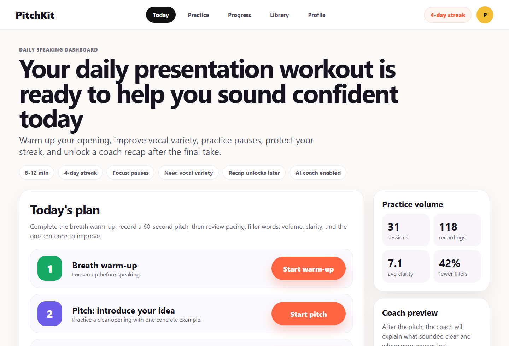

Review: [01-initial/review.md](01-initial/review.md)

## 2. Image Round 1

The first image-generation round explored three directions.

| Variant A | Variant B | Variant C |
| --- | --- | --- |
| 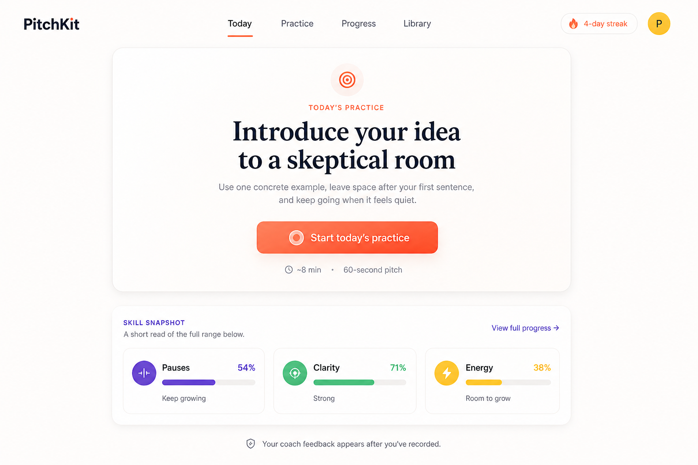 |  | 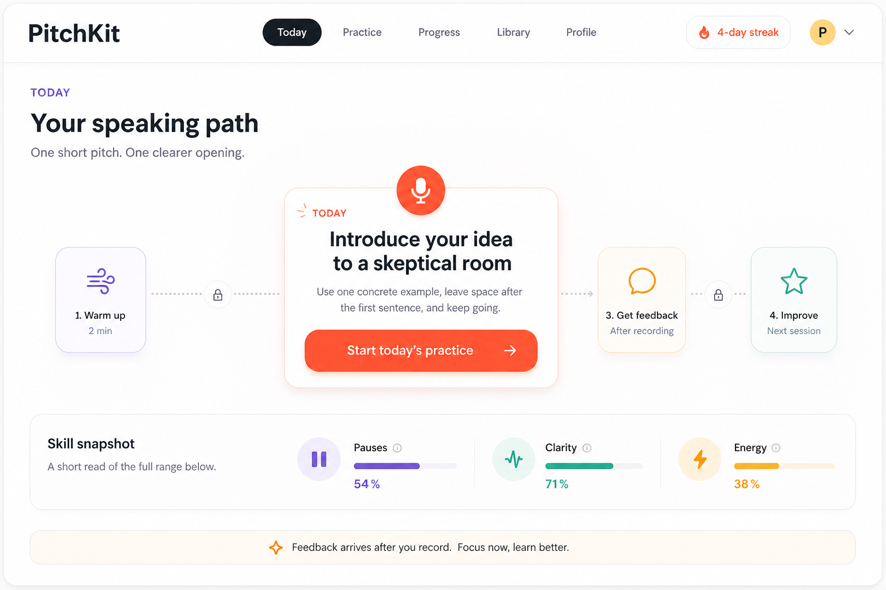 |

Decision:

- A won as the base because the task was the clearest first-glance object.
- B was rejected because it reintroduced a coach-prep side panel.
- C contributed the idea of the current task as the central unlocked action, but its future steps
  were rejected.

Artifacts:

- [prompt](02-image-round-1/prompt.md)
- [review](02-image-round-1/review.md)
- [decision](02-image-round-1/decision.md)

## 3. Image Round 2

The second round refined the winning direction.

| Variant A | Variant B | Variant C |
| --- | --- | --- |
| 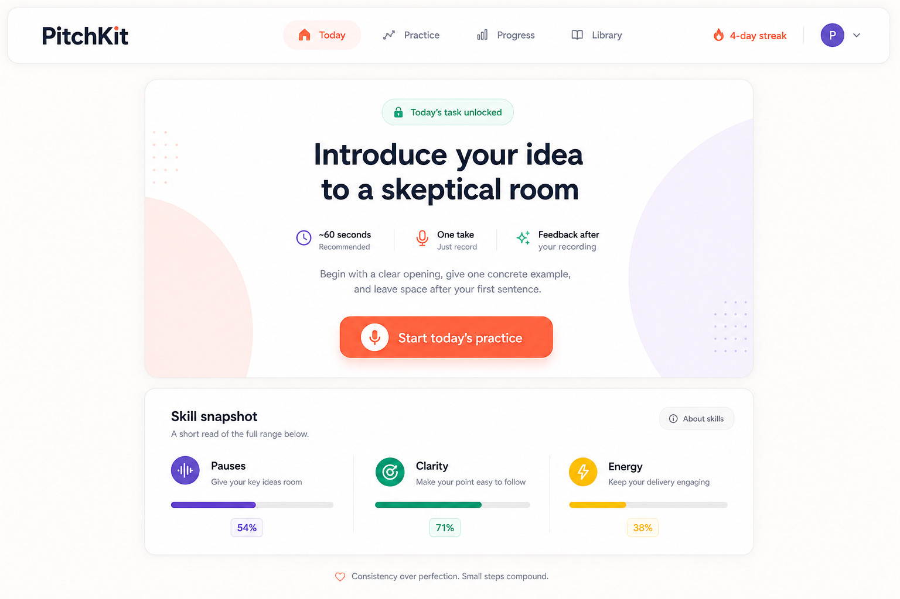 | 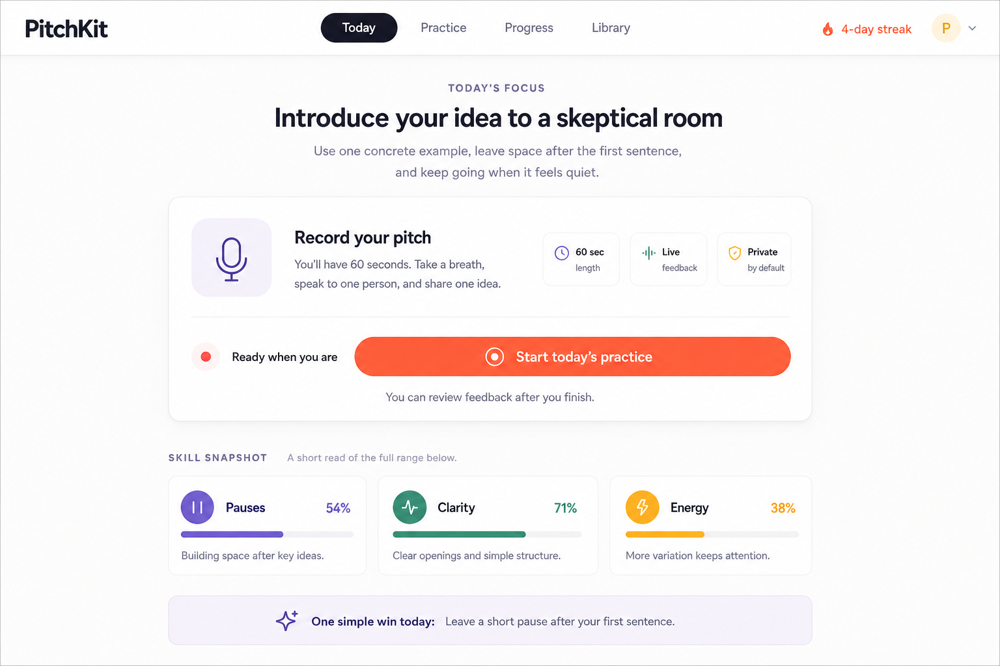 | 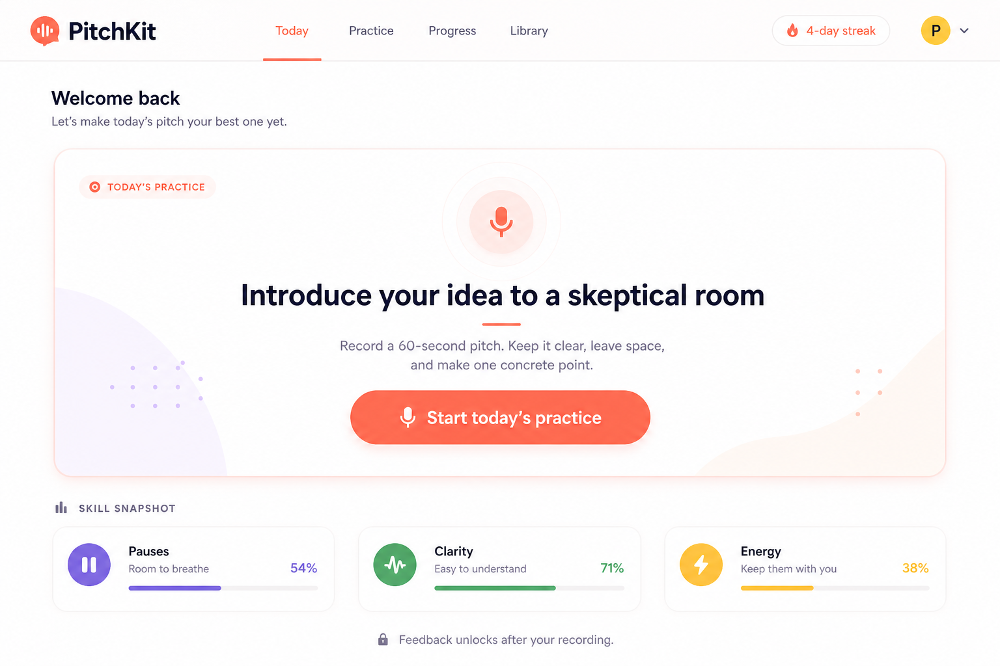 |

Decision:

- B had the best product-like recording module.
- C had the calmest visual rhythm.
- All variants kept trying to reintroduce future-feedback copy, which stayed rejected.

Artifacts:

- [prompt](03-image-round-2/prompt.md)
- [review](03-image-round-2/review.md)
- [comparison](03-image-round-2/comparison.md)
- [decision](03-image-round-2/decision.md)

## 4. Implementation V1

The selected direction became an actual running UI.


Review found that v1 was better than the initial screen, but still too hero-like. It also had an
explanatory lower card and process commentary that belonged in the demo log, not in the product UI.

Artifacts:

- [implementation instruction](04-implementation-v1/instruction.md)
- [review](04-implementation-v1/review.md)

## 5. Image Round 3 From The Implementation

The implementation screenshot became the seed for another image-generation round.

| Variant A | Variant B | Variant C |
| --- | --- | --- |
| 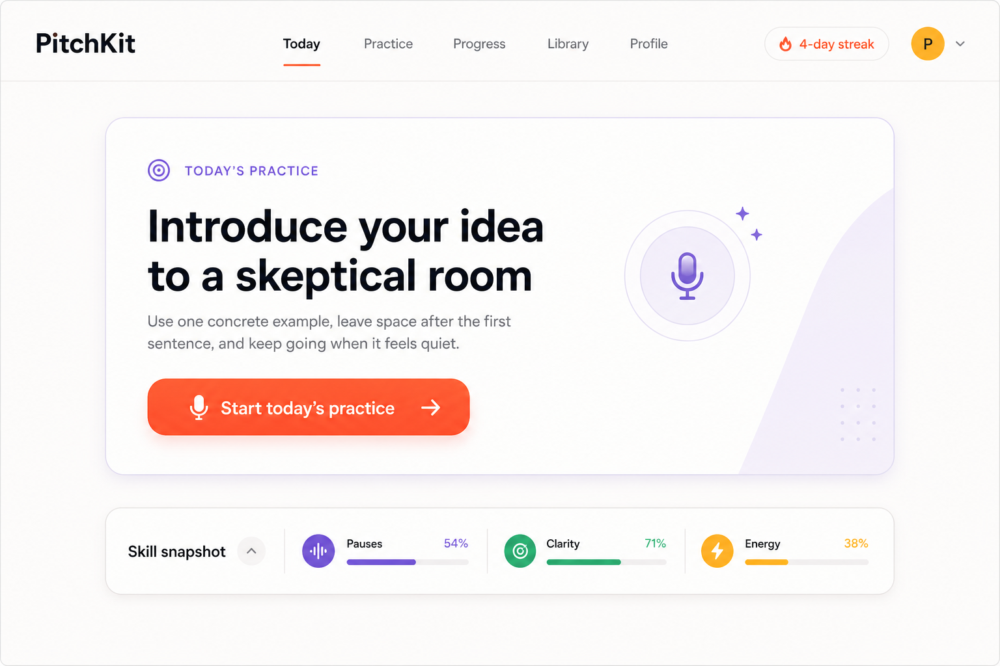 | 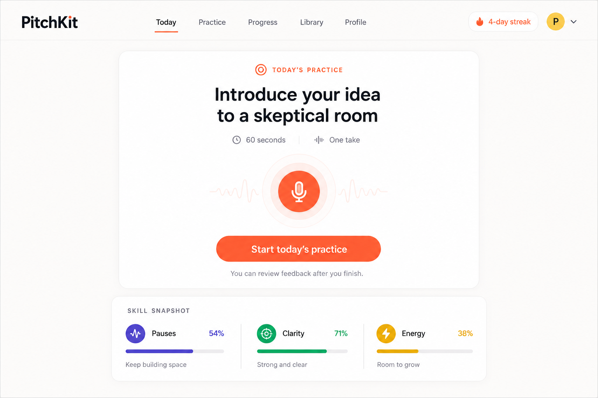 | 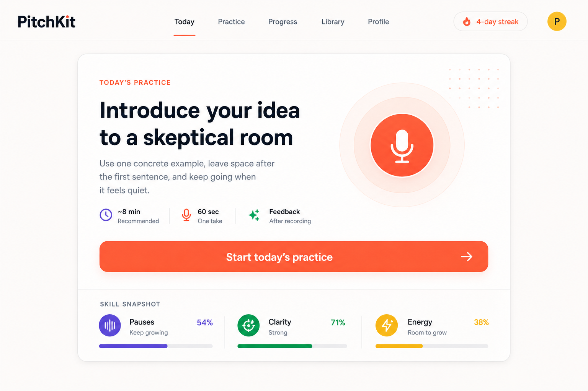 |

Decision:

- A won.
- It removed the second lower card and compressed the skill snapshot into a strip.
- B's microphone affordance was useful, but it again added future-feedback text.
- C's integrated surface was useful, but it also carried extra metadata.

Artifacts:

- [source screenshot](05-image-round-3-from-implementation/source-screenshot.png)
- [prompt](05-image-round-3-from-implementation/prompt.md)
- [review](05-image-round-3-from-implementation/review.md)
- [decision](05-image-round-3-from-implementation/decision.md)

## 6. Four Implementation Rounds

Each implementation round had a screenshot, review, comparison, and change log.

### Round 1: Hero Weight

| Before | After |
| --- | --- |
| 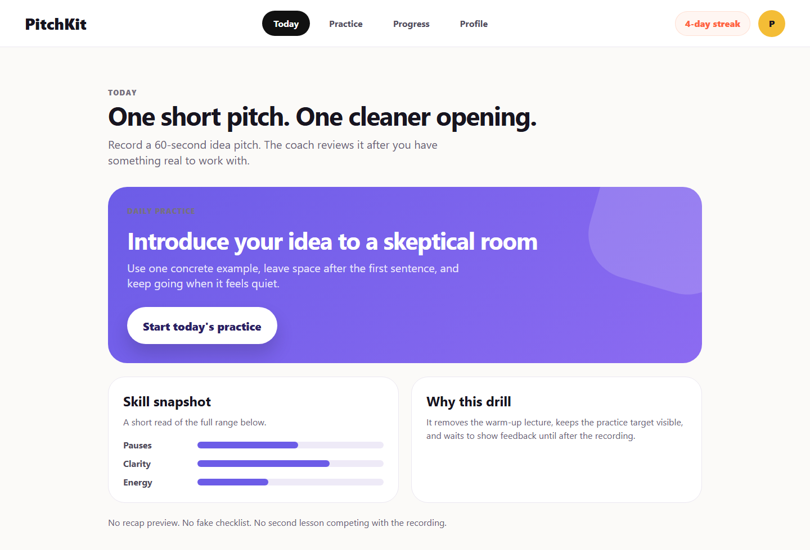 | 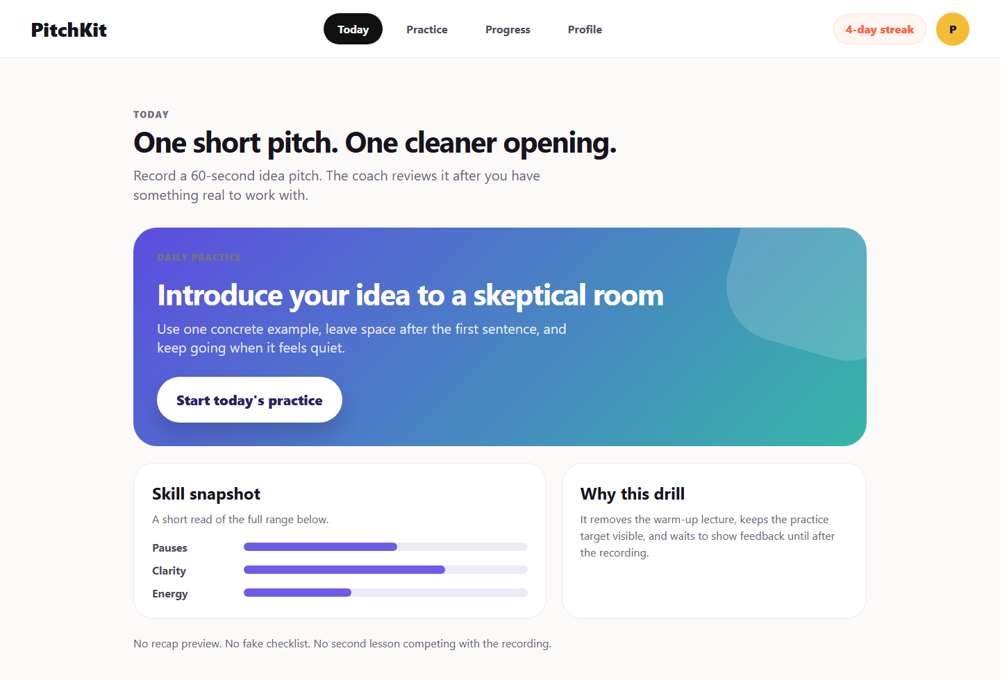 |

Artifacts: [review](06-implementation-round-1/review.md), [comparison](06-implementation-round-1/comparison.md), [changes](06-implementation-round-1/changes.md)

### Round 2: Layout Tightening

| Before | After |
| --- | --- |
|  | 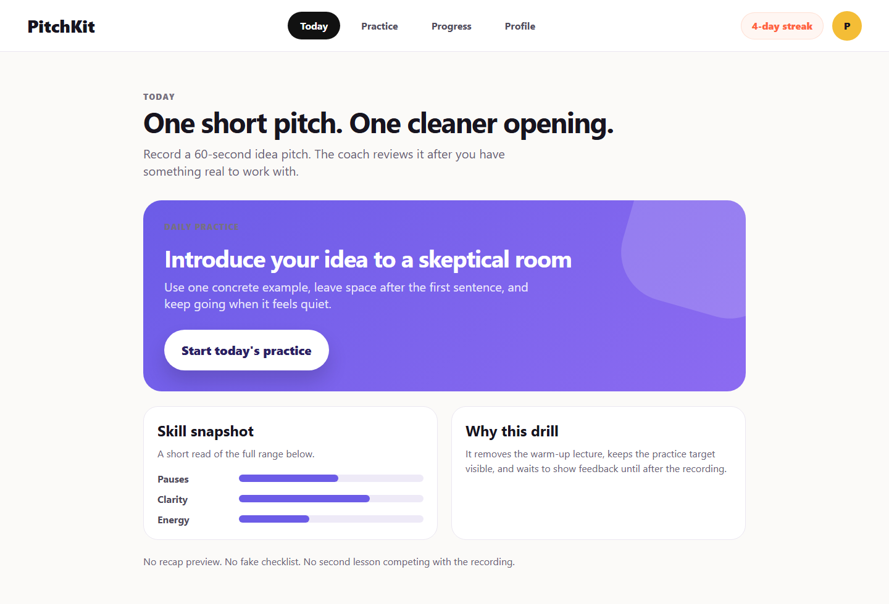 |

Artifacts: [review](07-implementation-round-2/review.md), [comparison](07-implementation-round-2/comparison.md), [changes](07-implementation-round-2/changes.md)

### Round 3: Scale And Controls

| Before | After |
| --- | --- |
|  | 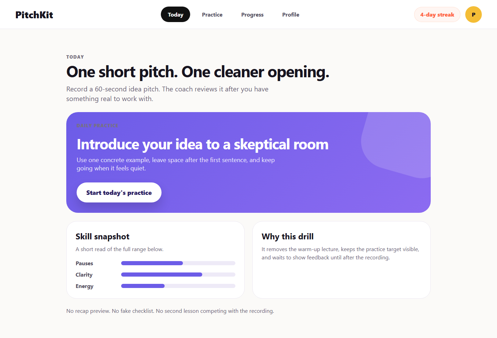 |

Artifacts: [review](08-implementation-round-3/review.md), [comparison](08-implementation-round-3/comparison.md), [changes](08-implementation-round-3/changes.md)

### Round 4: Remove The Last Explanatory Card

| Before | After |
| --- | --- |
|  |  |

Artifacts: [review](09-implementation-round-4/review.md), [comparison](09-implementation-round-4/comparison.md), [changes](09-implementation-round-4/changes.md)

## 7. Final Comparison

| Initial | Final |
| --- | --- |
|  | 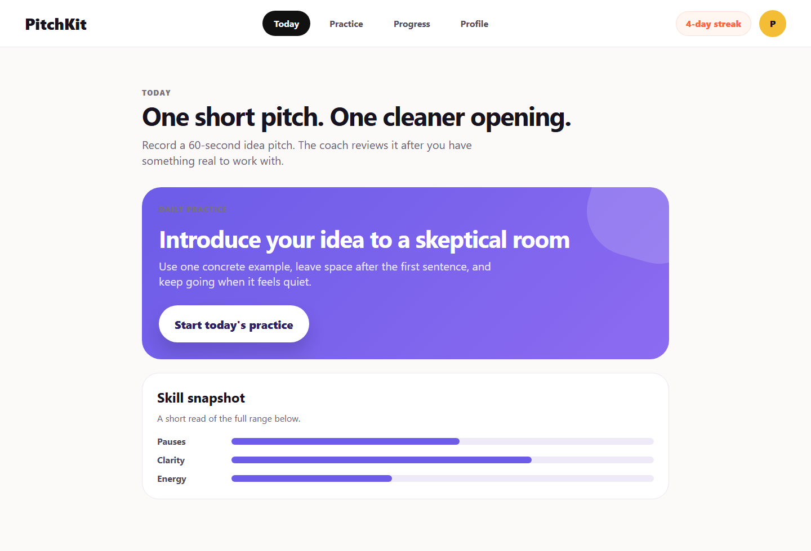 |

Final notes:

- [initial-vs-final.md](10-final/initial-vs-final.md)
- [remaining-issues.md](10-final/remaining-issues.md)

## Audit Trail

- [run-log.md](run-log.md)
- [image-ledger.md](image-ledger.md)
- [00-brief.md](00-brief.md)

This demo is intentionally image-led. Code exists only to produce running screenshots; the public
story is the hillclimb.
